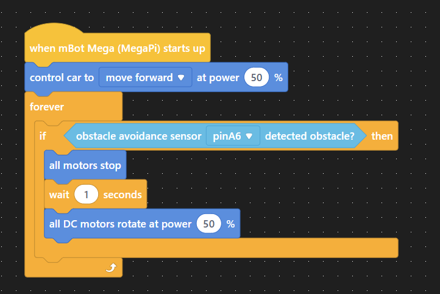

<!-- height or width of logo may be adjusted -->
<!-- This section is where you will replace the link to your transparent logo, the title of your project, and the very short desciptor of your project -->
<!-- If you used Canva to make your icon and don't want to pay for a background remover, you can use the website https://www.remove.bg/ to do so -->

  
  <h1 align="center">mBot Adventures!</h1>
  <h2 align="center">Using robots to teach block coding and algorithmic thinking</h2>
  
By The BeepBops 

<!-- the emojis are not set in stone! If you'd like you can remove them entirely or select your own from https://gist.github.com/rxaviers/7360908 you are welcome to -->

## :loudspeaker: About
The objective of the workshop is to have the participants learn basic coding fundamentals, demonstrate critical thinking, and apply block coding. Using block coding, the participants will control a robot called mBot Mega to navigate an obstacle course by utilizing various sensors equipped on the robot. While programming the mBots for real-world tasks, participants will learn about sensors, 'if' and 'else' statements, and booleans.
<!-- You can look at other TAP projects if you need a better idea of how to describe your workshops objectives -->

## :bulb: Project Information
<!-- 
Your Options for target audience: 
  - High School
  - College
  - Middle School
  - K-12
  - Non-Stem
  - Undergraduate
You can select from a range of audiences or a single auidience. Examples: 
    Middle School - College 
    High School - College
    K-12
  You will be presenting most often to your peers who are taking introductory technology classes, so more often than not you should be including college in your target audience range. 
-->
* <b>Project Title:</b> Using block coding to teach algorithms that can be used to control a robot
* <b>Difficulty Level:</b> Beginner
* <b>Target Audience:</b> Middle School - College Students
* <b>Duration of Workshop:</b> Short version, for the middle schoolers: 30 minutes
                                Longer version, for college students: 75 minutes
* <b>Needed Materials:</b> Computers/Laptops, Access to the https://ide.makeblock.com/ site, Foam Poster Boards, Scissors, Glue, MBot, Battery for Mbot, USB cable for Mbot connection.
* <b>Learning Outcomes:</b> Our main teaching goal will be introducing people to block coding, explaining if statements and while loops, and applying all the content to the mBot. 
* <b>Your Main Technology</b> Mbot Mega - A smart, remote-controlled robot that can be programmed to perform various maneuvers using its RGB modules and obstacle avoidance, line-following, and crash detection sensors.
* [Technology Ambassador Program](https://tapggc.org/) <b>(TAP)</b> is a project-based class that provides a collaborative environment for students to work with their fellow classmates on a semester-long project using technologies of their choice. TAP strives to increase participation in IT through numerous outreach activities and workshops that are designed to showcase the creative and fun side of technology.
<!-- Commercial Video stored in the Media folder will be linked here -->

[Commercial Video](https://github.com/user-attachments/assets/e2fc0eb3-cd85-47ba-97ca-ab2676bf6f7e)

<!-- videos can also be dragged and dropped into markdown files if you want them embedded -->

## :pencil2: Team: The Beep Bops

<!-- Use the team photo of your choice once youve uploaded it to the team photo folder within the media folder -->

> (From left to right: Sanaa Boddie, Jay Tak, Hector Cruz.)
<!-- replace with full names of your team members -->

* Sanaa Boddie
* Hector Cruz
* Jay Tak

## :mortar_board: Advisors
<!-- name of the two professors overseeing your TAP class -->
* Dr. Gunay
* Dr. Robertson

## :page_with_curl: Project Description

First, participants will code a robot to move forward and backward in a straight line. Then, it will be coded to detect objects that will trigger the mBot to rotate its course. And finally, it will navigate through a premade obstacle course. For the tasks mentioned, they will use block coding. Additionally, if there are any advanced participants, we will challenge them to use the line detection sensors to make the bot move around on a line. 

## :memo: Publications
1. Sanaa Boddie, Hector Cruz, Jay Tak, Cengiz Gunay, Cindy Robertson. mBot Adventures: Using robots to teach block coding and algorithmic thinking, Consortium for Computing Sciences in Colleges: Southeastern Region (CCSC:SE), November 1-2, 2024, Greenville, SC 
2. Sanaa Boddie, Hector Cruz, Jay Tak, Cengiz Gunay, Cindy Robertson. mBot Adventures: Using robots to teach block coding and algorithmic thinking, CREATE Symposium, November 14, 2024, Lawrenceville, GA

## :open_hands: Outreach

1. <b>TAP Expo</b>, October 8, 2024, Georgia Gwinnett College: to promote the IT field and encourage college students to sign up for TAP.
2. <b>Class Workshops</b>, October 21-25, 2024, Georgia Gwinnett College: to promote the IT field to non-IT students.
3. <b>CCSC:SE</b>, November 1-2, 2024, Furman University: to present the project to fellow IT students and professors from various universities.
4. <b>CREATE Symposium</b>, November 14, 2024, Georgia Gwinnett College: to present the project to non-IT and IT students, professors, and other attendees.
5. <b>S3 (Super Saturday Series)</b>, November 16, 2024, Georgia Gwinnett College: to promote the IT field and educate middle school students.

## :mag_right: Similar Projects

* [Ball is Life](https://tapggc.org/projects/2019/fall/ball-is-life) (Sphero)

## :computer: Technology
<!-- be sure to use the alt text feature in case anybody viewing your repo is using  screen reader! you want your workshop to be as accessible as possible -->

  

* [mBot Mega](https://www.makeblock.com/pages/mbot-mega-smart-remote-control-robot) is a buildable smart remote-control robot developed by Makeblock as an educational tool for children to learn computing and have fun.
* mBot Mega uses mBlock, which is block-based coding similar to Scratch. Similarly to Scratch, you can drag-and-drop coding blocks to develop a sequence that the mBot can follow.
* mBot is also equipped with sensors such as IR obstacle avoidance, line follower, and a crash sensor. These sensors can be used without programming but they can also be utilized within code for various purposes.
* We chose this technology because it was simple and easy to understand for anyone who doesn't know what programming is. 

## Project Setup
* The mBot Mega
* Any device with a Bluetooth connection
* An obstacle course

## Usage
* Connect the mBot Mega through a USB cable or a Bluetooth connection using your phone
* Code using block coding through the mBlock IDE
* Upload the code through the USB cable to the mBot and turn it on using the switch on the megaPi

## Building the mBot Mega
* [Click here to view mBot Mega building instructions](https://support.makeblock.com/hc/en-us/articles/1500009896321-Build-mBot-Mega)

## Short Demo Instructions 
* [Click here to view demo instructions pdf file](https://github.com/TAP-GGC/TheBeepBops/blob/a7f47cf25b2650eba115ab7c36221ab4f1020a78/documents/tutorial%20materials/Demo%20Instructions.pdf)

* Demo Video for Technology Prep (mBot setup and installing mBlock IDE)
* [Demo Video on how to setup the mBot and install the mBlock IDE](https://github.com/user-attachments/assets/1a5b3db2-43bf-4f02-b408-73ee8d0695b9)
* Demo Video on mBlock IDE setup after installation
* [Demo Video on how to setup the mBlock IDE after install](https://github.com/user-attachments/assets/c3fcbcd1-8721-4bc5-b552-7abf2d19060c)

## Workshop Instructions 
* [Click here to view the workshop instructions pdf file](https://github.com/TAP-GGC/TheBeepBops/blob/282ccf778098ee76d8b40ffa923941319c8c6ed9/documents/tutorial%20materials/Workshop%20Instructions.pdf)

* Workshop Presentation Walkthrough
* [Workshop Powerpoint Walkthrough](https://github.com/user-attachments/assets/980f01eb-da8f-4e93-be68-e38de1f776c7)

* Demo Video for Part 1 Coding in Workshop
* [Demo Video for Part 1 Coding in Workshop](https://github.com/user-attachments/assets/cae030b4-6840-47ff-8ff8-f4d1cb2b5530)
* Demo Video for Part 2 Coding in Workshop
* [Demo Video for Part 2 Coding in Workshop](https://github.com/user-attachments/assets/263e465f-ceb4-4a64-8e19-38c42bdf991b)

