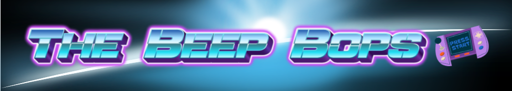

<!-- height or width of logo may be adjusted -->
<!-- This section is where you will replace the link to your transparent logo, the title of your project, and the very short desciptor of your project -->
<!-- If you used Canva to make your icon and don't want to pay for a background remover, you can use the website https://www.remove.bg/ to do so -->

  
  <h1 align="center">A Robot Obstacle Course Adventure!</h1>
  
By The BeepBops 

<!-- the emojis are not set in stone! If you'd like you can remove them entirely or select your own from https://gist.github.com/rxaviers/7360908 you are welcome to -->

## :loudspeaker: About
The objective of the workshop is to have the participants learn basic coding skills, demonstrate critical thinking, and apply block coding. The block coding will have the participants control a robot called mBot Mega to navigate an obstacle course by utilizing various sensors equipped on the robot. While programming the mBots for real-world tasks, participants will learn about sensors, 'if' and 'else' statements, and booleans.
<!-- You can look at other TAP projects if you need a better idea of how to describe your workshops objectives -->

This workshop will have participants:

- Program robots to move around through obstacle courses using their onboard sensors for the task of obstacle avoidance.
- Participate in a robot competition through a track designed by us, since participants can add variation to their programs like making the mBot move faster/slower, turn more sharply, etc... .

## :bulb: Project Information
<!-- 
Your Options for target audience: 
  - High School
  - College
  - Middle School
  - K-12
  - Non-Stem
  - Undergraduate
You can select from a range of audiences or a single auidience. Examples: 
    Middle School - College 
    High School - College
    K-12
  You will be presenting most often to your peers who are taking introductory technology classes, so more often than not you should be including college in your target audience range. 
-->
* <b>Project Title:</b> Using block coding to teach how algorithms can be used to control a robot
* <b>About:</b> The project will include 3 parts, the block coding, the track, and the actual mBot itself. We will start by presenting to our audience what coding is, how it works, and how it can be applied to the real world. We will have our attendees start with learning the basic concepts of coding. Then we will teach them how to use one of the most basic forms of code being block code with the program that comes with mBot conveniently called mBlock. After showing a very brief demonstration of what you can do with code we will have them start programming in order for them to learn how to code with algorithms. We will have them start off easy with a very basic goal that is being able to make the mBot move in a straight line back and forth as a loop. Once that is done we will move to phase 2 which will introduce some more commands that can be executed in the code, and have the participants move the mBot in a circle going around in a controlled pattern. We will have a finished code that works with everything mentioned above and we will guide them step by step in order to reach the final code. After phase 1 and 2 is done we will move on to the final challange and incorporate the obstacle avoidance sensors. We will have a premade obstacle course for the participants to try and complete it. After all participants are able to complete the course if there is time we will have bonus phase as a race! The participants can compete in and see who finishes first! The track will be taken apart down the middle to allow collisions of the mBots! We will have a prize for all those who participated and extra prizes for the winners. 

* <b>Difficulty Level:</b> Beginner
* <b>Target Audience:</b> K12 - College (edit .md file to view all options presented in the markdown comments)
* <b>Duration of Workshop:</b> Short version, for the middle schoolers: 30 minutes
                                Longer version, for the college students: 90 minutes
* <b>Needed Materials:</b> Computers with keyboards, Access to the https://ide.makeblock.com/ site,Foam Poster Boards, Markers, and MBot.
* <b>Learning Outcomes:</b> Our main teaching goal will be teaching people to create block coding, learning if statements and while loops, and apply everything covered to the mBot. 
* <b>Your Main Technology</b> Name of Technology and then a brief descriptor. You will go more in depth on the technology used in a different section. 
* [Technology Ambassador Program](https://tapggc.org/) <b>(TAP)</b> is a project-based class that provides a collaborative environment for students to work with their fellow classmates on a semester-long project using technologies of their choice. TAP strives to increase participation in IT through numerous outreach activities and workshops that are designed to showcase the creative and fun side of technology.
<!-- Commercial Video stored in the Media folder will be linked here -->

[Commercial Video](https://github.com/TAP-GGC/NinjaTurtles/assets/157164928/94b037a6-8912-44da-8a8c-84c0b8a0afb8)

<!-- videos can also be dragged and dropped into markdown files if you want them embedded -->

## :pencil2: Team: The Beep Bops

<!-- Use the team photo of your choice once youve uploaded it to the team photo folder within the media folder -->

> (From left to right: Sanaa,  Jay, Hector Cruz.)
<!-- replace with full names of your team members -->

* Sanaa Boddie
* Hector Cruz
* Jay Tak
* Bella Toledo (Honorary) </3

## :mortar_board: Advisors
<!-- name of the two professors overseeing your TAP class -->
* Dr. Gunay
* Dr. Robertson

## :page_with_curl: Project Description

First, participants will code a robot to go back and forth in a straight line, then in a circular pattern, and finally through a premade obstacle course. For this, they will use block coding. Lastly, if there are any advanced participants, we will challenge them to use the line detection senors to make the bot move around on a line. 

## :memo: Publications
<!-- team members, then professors/advisors. "Name of Publication", event, month and day, year, Georgia Gwinnett College. -->
1. Team Member, Team Member, Team Member, John Doe, Jane Doe. "A Real Fake Workshop", Fake Event, April 1, 2024, Georgia Gwinnett College.  

## :open_hands: Outreach
<i>List the outreach events your team has participated in. </i>

Example:

1. <b>TAP Expo</b>, April 1, 2021, Georgia Gwinnett College: to promote the IT field and encourage college students to sign up for TAP.
2. <b>Class Workshops</b>, April 13-15, 2021, Georgia Gwinnett College: to promote the IT field to non-IT students.

## :mag_right: Similar Projects
<i>Use this section to link to a project done in the TAP program that is related in some way to your own. This can be a sister project done during your TAP semester or a TAP project done in the past. Example: </i> 

If you're interested in more workshops that utilize Scratch, check out [Space Mechanic](https://github.com/TAP-GGC/NinjaTurtles)!

## :computer: Technology
<i> Replace Scratch with whatever technology you're using and make sure to have a logo of that technology uploaded to the technology folder within the media folder. </i>
<!-- be sure to use the alt text feature in case anybody viewing your repo is using  screen reader! you want your workshop to be as accessible as possible -->

  

* [mBot Mega](https://www.makeblock.com/pages/mbot-mega-smart-remote-control-robot) is a buildable smart remote-control robot developed by Makeblock as an educational tool for children to learn computing and have fun.
* mBot Mega uses mBlock, which is block-based coding similar to Scratch. Similarly to Scratch, you can drag-and-drop coding blocks to develop a sequence that the mBot can follow.
* mBot is also equipped with sensors such as IR obstacle avoidance, line follower, and a crash sensor. These sensors can be used without programming but they can be utilized within code for various purposes.
* Explain why your team chose this technology for this workshop.

## Project Setup/Installation 
<i> This section is dedicated to linking to .md files in your documents/tutorial/ folder that will contain instructions on installation

Your repo doesn't have to have every section used below. This is just an example so you can get an idea of what your own repo should look like</i>

### Opening a blank Scratch page 
[Click here to view instructions](/Documents/tutorial/Opening%20a%20blank%20Scratch%20page.md)

[Video with Scratch instructions](https://youtu.be/v-GUbj7DMEE)

<!-- if your project uses scratch, you can reuse any of these instructions (be sure to include CS First alternatives) -->
## CS First Installation Walkthrough
[Click here to view instructions](/Documents/tutorial/CS%20FIRST/CS%20First%20Walkthrough.md)

### Getting to the game 
[Click here to view instructions](/Documents/tutorial/Getting%20to%20the%20Game.md)

## Usage
<i> Describe HOW to use your game. </i> 
Example: 
1. Press the Left arrow key to move to the left.
2. Press the Right arrow key to move to the right.
3. Press the Up arrow key to move up.
4. Press the Down arrow key to move down.
5. You may also replace the arrow keys with a Makey Makey. 

## Short Demo Instructions 
[Demo Video on how to install and play our game](https://youtu.be/mA80Aa55t-U)

## Workshop Instructions 
[Click here to view workshop walkthrough pdf file](/Documents/tutorial/Scratch%20Workshop%20Walkthrough.pdf)

[Our Game Workshop Video](https://youtu.be/Mtsre0iMStM)

